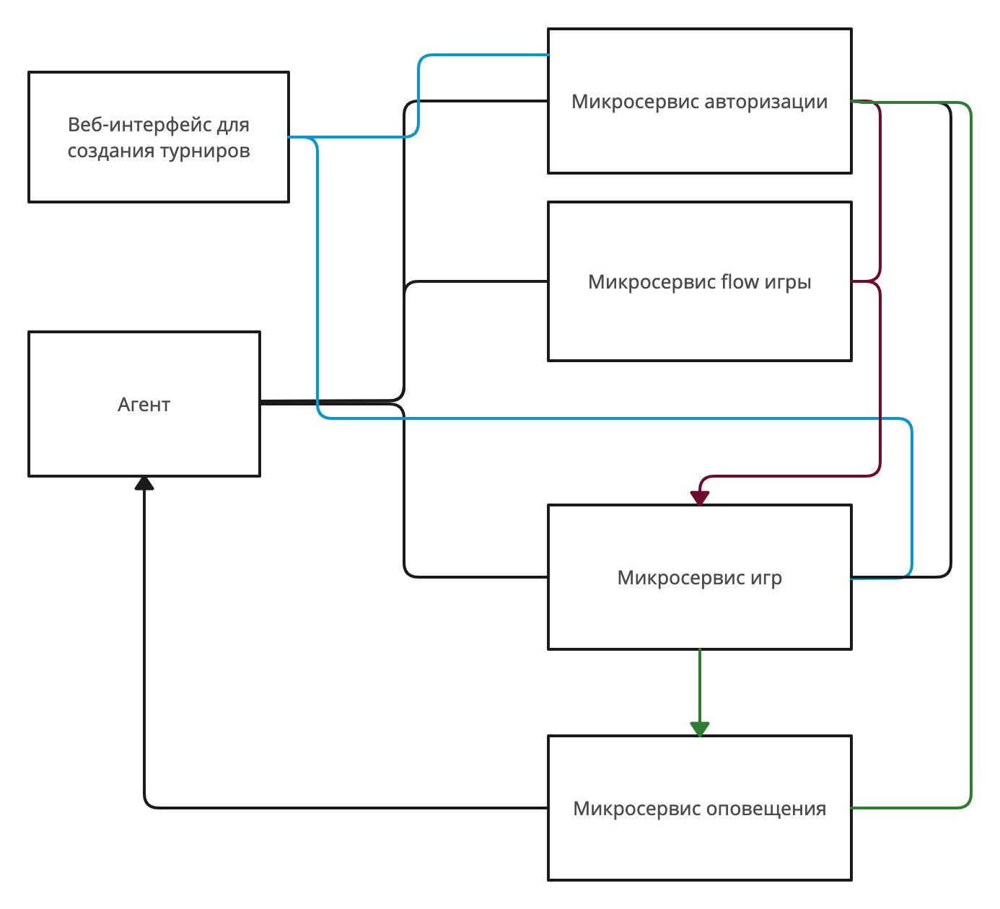

# Проект для домашних заданий по курсу "Архитектура и шаблоны проектирования"

## ДЗ по теме Модульные тесты
реализация функции Equation.solve(double a, double b, double c) + тесты

## ДЗ по теме Определение абстракций, устойчивых к изменениям требований.
Реализация движения и поворота объекта + тесты

собрать моки для тестов 
--dart run build_runner build

## ДЗ по теме Микросервисная архитектура

**Агент** - приложение, в котором происходит отображение игры для конкретного пользователя. Агент передает команды от ввода пользователя и получает команды от микросервиса flow игры. Для идентификации пользователя, агент передает данные в микросервис авторизации и получает авторизационный токен, на основании которого происходит выбоор стратегии игры.

**Веб-интерфейс для создания турниров** - служит для создания, редактирования информации о турнирах или отдельных играх. Обращается к сервису авторизации для авторизации пользователя, получении данных о пользователях для создания игр, турниров. Сохраняет данные через сервис игр.

**Микросервис авторизации** - по данным пользователя формирует jwt токен, обращается к сервису игр для проверки возможности доступа к запрашиваемому турниру, игре. Возвращает контактную информацию пользователя. Этот же сервис хранит информацию зарегистрированных пользователей.

**Микросервис игр** - сохраняет информацию о созданных играх, турнирах, рейтинге пользователей. Создает оповещения для пользователей и передает в микросервис оповещения.

**Микросервис оповещения** - принимает данные об оповещении, обращается к микросервису авторизации для получения контактных данных пользователя, отправляет оповещения.

**Микросервис flow игры** - обрабатывает команды пользователя в игровом процессе, возвращает обновленные данные в агент. Данные о рейтинге передает в микросервис турниров.

Все сервисы имеют возможность обратиться к сервису авторизации за открытым ключом для проверки jwt токена.

###Узкие места и потенциальные проблемы масштабирования приложения
1. Микросервис авторизации. Все сервисы обращаются к нему за получение открытого ключа + запросы от пользователей. Способ решения проблемы - кешировать открытый ключ для сервиса, запрашивать новый ключ по определенному событию из микросервиса авторизации. 
2. Микросервис flow игры. При проведении турниров и больших количествах игр возрастает нагрузка на сервис, возможно увеличение отклика сервиса. Способ решения проблемы - отдельные игры запускать в отдельных потоках, поднимать несколько интсансов сервиса, распределять нагрузку по ним.

###Компоненты, к которым чаще всего будут меняться требования
1. Микросервис flow игры. Скорее всего будут меняться или добавляться правила игры, вводиться новые уровни, новые элементы. Необходимо продумать гибкую систему настройки и добавления новой функциональности. Хранение системы команд в конфигурационных файлах для возможности их легкого внедрения и настройки.
2. Микросервис игр. Скорее всего будут меняться правила создания турниров. Необходимо продумать гибкую настройку правил создания турниров и изменения этих правил.

