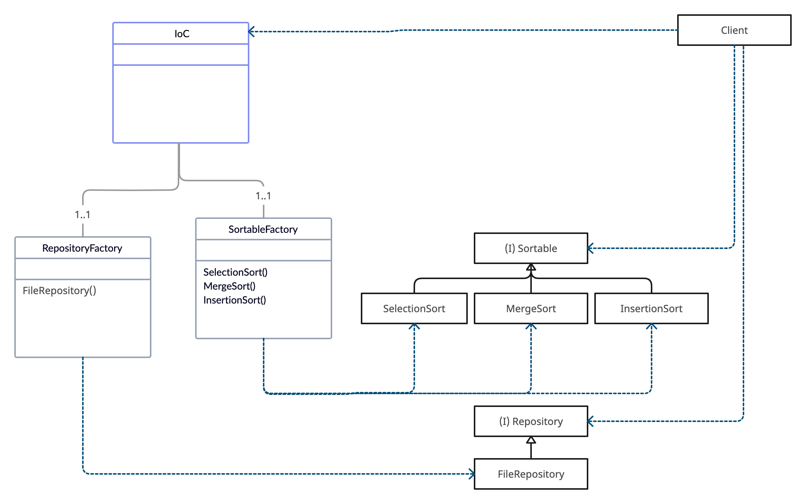

## Usage

```
SortProgram(pathIn: 'in.txt', pathOut: 'out.txt', sortMethod: 'selection').execute();
```

## Additional information

Использована расширяемая абстрактная фабрика для инициализации разных методов сортировки. 
В качестве расширяемой абстрактной фабрики используется IoC контейнер SortIoC.

В задании было указано использовать для хранения начальных данных и результата файловую систему. 
При необходимости можно в используемый ioC контейнер добавлять зависимости для различных репозиториев.


